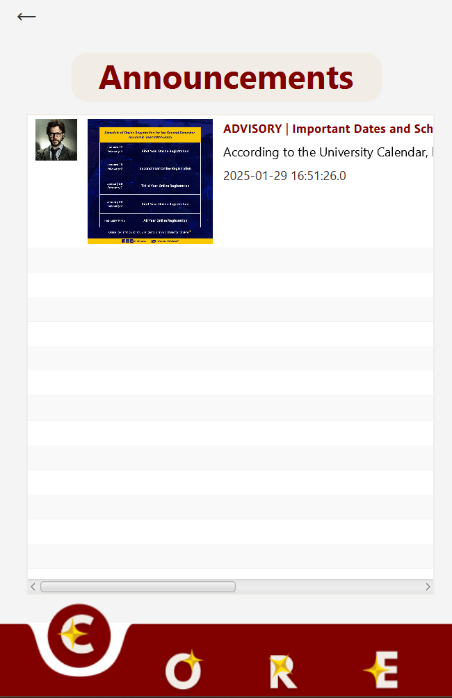

# 🎓 PUP CORE - An Innovative Campus Productivity Suite
*Our Campus Connection, Organization, Resource, and Excellence.*

Welcome to **PUP CORE**, a comprehensive all-in-one software tailored for the **Polytechnic University of the Philippines (PUP)** to streamline campus life, boost productivity, and promote academic excellence. This project demonstrates the core **Object-Oriented Programming (OOP) principle of Polymorphism**, delivering dynamic, role-specific features for students and professors.

---

# 🚀 Features

## 1. **User Profile - ProfileHub**
#### *"Where your PUP story begins."*
- 🧑‍🎓 **Students**: View academic details (course, year level, subjects).
- 👨‍🏫 **Professors**: View department, office hours, and subjects taught.
- ✏️ Update profile details based on user role via overloading.

---

## 2. **Communication Portal - PUPConnect**
#### *"Stay connected, PUP-style."*
- 📩 Role-specific messaging: Students message classmates; professors broadcast announcements.
- 📨 Overloaded messaging: Private messages.
- 🔒 Secure, campus-only communication for distraction-free collaboration.

---

## 3. **Schedule Tracker - PUPriorities**
#### *"Make time for what matters—stay ahead, stay on track."*
- 📆 Consolidate academic timetables, extracurricular activities, and personal appointments.
- 🔔 Reminders to avoid conflicts.
- 🛠 Dynamic scheduling for students (deadlines, events) and professors (lectures, meetings).

---

## 4. **Event Hub - PUPEvents**
#### *"All your campus events in one place."*
- 🎉 Discover academic, cultural, and sports events.
- 📜 Tailored event information (guest speakers, schedules, team lineups).
- ➕ Add events via overloading (title, date, description).

---

## 5. **Campus Map - ISKOMPASS**
#### *"Your Iskolar compass to navigate campus life."*
- 🗺️ Role-specific navigation: Students find classrooms and libraries; professors locate offices and lounges.
- 🍴 Food stall details, including menus.
- 🧭 Overloaded route finder (basic directions or detailed routes).

---

## 6. **Achievement Dashboard - PUPExcel**
#### *"Celebrating your PUP-worthy achievements."*
- 🏆 Track academic, extracurricular, and personal milestones.
- 📜 Students: Document awards and certifications.
- 📚 Professors: Record research, speeches, and accolades.
- ✍️ Add achievements via overloading (title, description, date).

---

## 🎯 Application of Polymorphism

**Polymorphism** is central to the functionality of PUP CORE, enabling role-specific customizations through:
- **Method Overriding**: Customize core functionalities for students and professors.  
  Example: `viewProfile()` displays student-specific or professor-specific details.
- **Method Overloading**: Flexible functionalities for different parameters.  
  Example: `addEvent(String title, String date)` vs. `addEvent(String title, String date, String description)`.

---

## 🛠️ Tools & Technologies
- **JavaFX** for the GUI.
- **MySql** for database management.
- **Maven** for dependency management.
- **Scene Builder** for FXML design.

---

## 🏗️ Installation & Setup
#### 1. Clone the repository:
   ```bash
   git clone https://github.com/AshleyFullero/PUP-CORE.git
   ```
#### 2. Open the project in your favorite IDE.
#### 3. Install dependencies using Maven.
#### 4. Run the application:
   ```bash
   mvn javafx:run
   ```
### Alternative Installation Guide

#### 1. Download Required Files
Download the ZIP file and the SQL file for the project.

#### 2. Extract and Open Project
- Unzip the file.
- Right-click the project folder and select **"Open Folder as IntelliJ IDEA Project."**
#### 3. Update Database Credentials
- Navigate to **DBConnection** under the database package.
- Update the **USER** and **PASSWORD** fields with your MySQL credentials.
  

#### 4. Create MySQL Connection
- Open MySQL and create a new connection with a custom name.
  

#### 5. Open the Connection
- Select the connection you created.
- Navigate to **Schemas** and click **Server.**
  

#### 6. Import Database
- Go to **Data Import.**
  
- Select **"Import from Self-Contained File."**
- Choose **pup_core.sql** as the file.
- From the dropdown menu, select **MySQL** and create a new schema named **pup_core.**
  

#### 7. Complete Database Import
- Click **Import Progress** and start the import process.
- Once the import is successful, return to IntelliJ.
  
  

#### 8. Run the Program
- Locate the **Main** class in IntelliJ.
- Run the program and create an account to start using the application.
  

---


## 📸 Screenshots

#### 1. **User Login**


#### 2. **Create Account for Students and Professors**
| General Account Creation  | Student Account Creation | Professor Account Creation|  
|--------------------------|----------------------------------------------------|--------------------------|  
|  |  |  |  

#### 3. **Home**
| Professor User Home | Student User Home |  
|---------------------|-------------------|  
|  |  |  

#### 4. **Profile Hub - Edit Profile Picture & Details**
| Professor Profile  | Student Profile |  
|--------------------|-----------------|  
|  |  |  

| Edit About Section | Keynotes & Research |  
|---------------------|---------------------|  
|  |  |  
|  |  |  

| Professor Update | Student Update            |  
|------------------|---------------------------|  
|  |  |  

#### 5. **Communication - User can create or view announcements & messages.**
| Create Announcement  and Messages             | View Message Inbox and Announcement            |  
|-----------------------------------------------|------------------------------------------------|  
|  |            |  
|    |  |  

| Conversations & User Search | View User Profiles & Achievements |  
|-----------------------------|-----------------------------------|  
|  |  |  
|  |  |  

#### 6. **Organization - user can add task and create events.**
| Add Tasks & Events | Settings & Calendar |  
|-------------------|---------------------|  
|  |  |  
|  |  |  

| Task Management | Professor Task |  
|-----------------|-----------------|  
|  |  |  

#### 7. **Resources - user can navigate the map smoothly**
| Navigate the Map | Facilities & Food Locations |  
|------------------|-----------------------------|  
|  |  |  
|  |   |  


#### 8. **Excellence - user can share Achievements, Thoughts, and Experiences**
| View Post        | Create post       |  
|------------------|-------------------|  
|  |  |  
|  |  |  

---


## 📚Future Enhancements

### AI-Powered Friend Recommendations
Enhance user connections by suggesting friends based on shared activities, interests, and interactions.

### Real-Time Notification System
Implement instant notifications for events, messages, and important updates to keep users engaged and informed.

### Learning Vault - PUPStudyHub
A centralized platform for organizing learning materials across various courses and platforms.
- Students can seamlessly upload, categorize, and access their resources.
- Integrated note-taking features ensure that study materials remain consolidated for easy reference.

### Budget Tracker - ISKOBudget
A user-friendly financial management tool designed to help students make informed decisions about their finances.
- Manage expenses and monitor budgets.
- Set financial goals with personalized insights.
- Analyze spending patterns to develop smart budgeting habits.

Stay tuned for more updates and innovations to enhance the user experience!

---
## 📝 License
This project was developed solely for academic purposes under the guidance of the Polytechnic University of the Philippines (PUP).

---

## 🤝 Acknowledgments

### **TEAM OOPTIMUS PRIME**

#### **Team Leader and Programming Lead**
- **Ashley Nicole S. Fullero** — *Project Manager, Full-Stack Developer (Front-End & Back-End)*

#### **Team Members**
- **Nicko Adrian E. Baptista** — *Front-End, Documentation Specialist*
- **Jule Alexander B. Coralde** — *UI/UX Designer, Documentation Specialist*
- **Denelle Rose D. Nava** — *Front-End, Documentation Specialist*
- **Kyle Ethan C. Porciuncula** — *UI/UX Designer, Documentation Specialist*
- **Loreen May Jodi G. Gallos** — *Back-End, Documentation Specialist*
- **Clarisse Jem T. Salazar** — *Back-End, Researcher*

#### **Faculty Advisor**
- **Prof. Chris Piamonte** — *For invaluable guidance and mentorship*

---
## 🌐 Contact Information

If you have any questions, suggestions, or need assistance, feel free to reach out!

- **Email**: [ashleyfullero0906@gmail.com](mailto:ashleyfullero0906@gmail.com)
- **LinkedIn**: [Ashley Nicole Fullero](https://www.linkedin.com/in/ashleyfullero/)
- **GitHub**: [Ashley Fullero](https://github.com/AshleyFullero)

I’m happy to connect and discuss any queries or feedback you may have. Looking forward to hearing from you!
