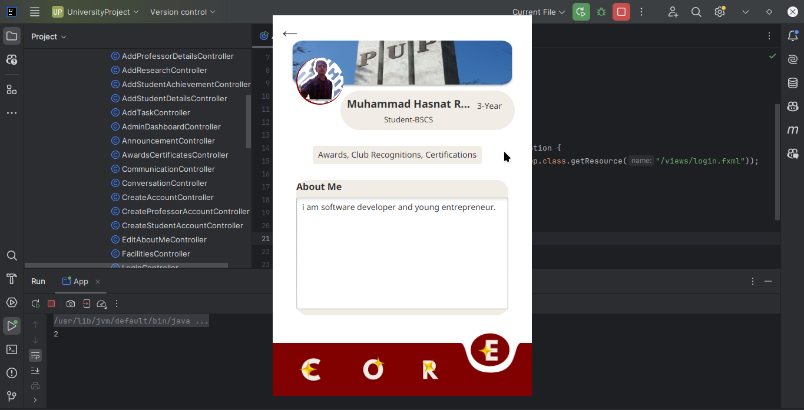
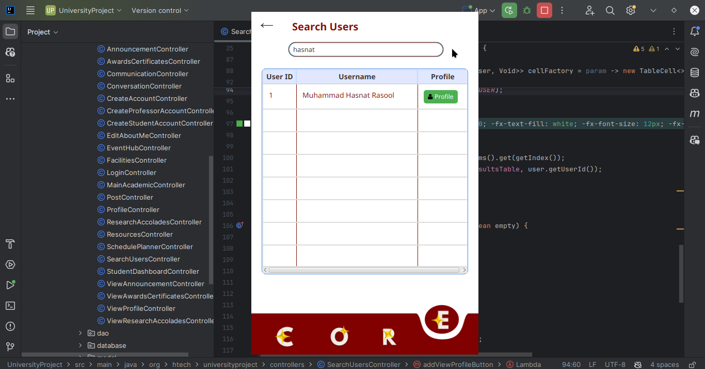

# 🎓 PUP CORE - An Innovative Campus Productivity Suite

Welcome to **PUP CORE**, a comprehensive software tailored for the **Polytechnic University of the Philippines (PUP)** to streamline campus life, boost productivity, and promote academic excellence. This project demonstrates the core **Object-Oriented Programming (OOP) principle of Polymorphism**, delivering dynamic, role-specific features for students and professors.

---

## 🚀 Features

### 1. **User Profile - ProfileHub**
"Where your PUP story begins."
- 🧑‍🎓 **Students**: View academic details (course, year level, subjects).
- 👨‍🏫 **Professors**: View department, office hours, and subjects taught.
- ✏️ Update profile details based on user role via overloading.

---

### 2. **Communication Portal - PUPConnect**
"Stay connected, PUP-style."
- 📩 Role-specific messaging: Students message classmates; professors broadcast announcements.
- 📨 Overloaded messaging: Private messages.
- 🔒 Secure, campus-only communication for distraction-free collaboration.

---

### 3. **Schedule Tracker - PUPriorities**
"Make time for what matters—stay ahead, stay on track."
- 📆 Consolidate academic timetables, extracurricular activities, and personal appointments.
- 🔔 Reminders to avoid conflicts.
- 🛠 Dynamic scheduling for students (deadlines, events) and professors (lectures, meetings).

---

### 4. **Event Hub - PUPEvents**
"All your campus events in one place."
- 🎉 Discover academic, cultural, and sports events.
- 📜 Tailored event information (guest speakers, schedules, team lineups).
- ➕ Add events via overloading (title, date, description).

---

### 5. **Campus Map - ISKOMPASS**
"Your Iskolar compass to navigate campus life."
- 🗺️ Role-specific navigation: Students find classrooms and libraries; professors locate offices and lounges.
- 🍴 Food stall details, including menus.
- 🧭 Overloaded route finder (basic directions or detailed routes).

---

### 6. **Achievement Dashboard - PUPExcel**
"Celebrating your PUP-worthy achievements."
- 🏆 Track academic, extracurricular, and personal milestones.
- 📜 Students: Document awards and certifications.
- 📚 Professors: Record research, speeches, and accolades.
- ✍️ Add achievements via overloading (title, description, date).

---

## 🎯 Application of Polymorphism

**Polymorphism** is central to the functionality of PUP CORE, enabling role-specific customizations through:
- **Method Overriding**: Customize core functionalities for students and professors.  
  Example: `viewProfile()` displays student-specific or professor-specific details.
- **Method Overloading**: Flexible functionalities for different parameters.  
  Example: `addEvent(String title, String date)` vs. `addEvent(String title, String date, String description)`.

---

## 🛠️ Tools & Technologies
- **JavaFX** for the GUI.
- **MySql** for database management.
- **Maven** for dependency management.
- **Scene Builder** for FXML design.

---

## 🏗️ Installation & Setup
1. Clone the repository:
   ```bash
   git clone https://github.com/--------.git
   ```
2. Open the project in your favorite IDE.
3. Install dependencies using Maven.
4. Run the application:
   ```bash
   mvn javafx:run
   ```

---

## 📸 Screenshots
1. **User Profile View**:
   
2. **Search User View**:
    

---

## 📚 Future Enhancements
- Add AI-powered friend recommendations based on shared activities and interests.
- Include a real-time notification system for events and messages.

---

## 📝 License
This project is developed for **academic purposes only** under the guidance of **PUP University**.

---

## 🤝 Acknowledgments
- **Prof. [Your Professor's Name]** for guidance.
- **Team Members** for collaboration.

---

Happy Coding! 🎉
